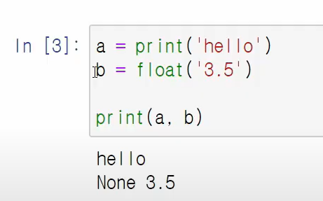
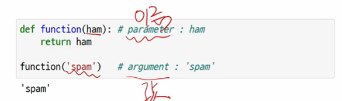
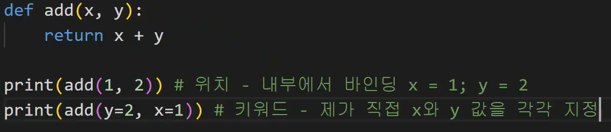

## 함수

**함수란?**

- 특정한 기능을 하는 코드의 조각묶음.

- 특정 명령을 수행하는 코드를 매번 다시 작성하지 않고, 필요시에만 호출하여 간편히 사용
- 구현되어 있는 함수가 없는 경우 사용자가 직접 함수를 작성가능.


## 함수의 기본 구조

- 선언과 호출

  1. 함수의 선언은 def키워드 활용

  2. 들여쓰기를 통해 function body(코드블록)을 작성

- 입력
- 문서화
- 범위
- 결과값


### 사용자 함수

```python
# 함수의 선언 실습
# 세제곱 반환 함수
# input, output 설정 고민
# cube(2), cube(7)과 같음 식으로 호출될 것.
def cube(number):
    return number ** 3

print(cube(2))
#8
```

1. 함수의 이름
2. input의 이름
3. 로직작성
4. 결과


## 함수의 결과값

- void function
- value returning function



print함수는 return값이 없기 때문에 위와 같은 결과가 나옴

return을 하게 되면 해당 값을 반환한 후 함수 종료

```python
def m(x, y):
    return x - y
	return x * y

print(m(1, 2))
# 결과
-1
# return을 하게되면 해당 값 반환 후 함수 종료. x - y 반환 후 종료되므로 그 아래의 x * y는 반환X

def m(x, y):
    return x - y, x * y

print(m(1, 2))
# 결과
(-1, 2)
```

**return은 항상 하나의 객체만을 반환. 위의 경우 하나의 튜플을 반환한 것.**


**출력과 return의 차이**


## 함수의 입력

- parameter: 함수를 실행할 때 함수 내부에서 사용되는 식별자
- argument: 함수를 호출할 때, 넣어주는 값



argument는 **필수**와 **선택**으로 구분됨





*args -> tuple로 취급

```python
def add(*args):
    return args, type(args)
    
print(add(1, 2, 3))
# 결과
(1, 2, 3) class tuple
```


**kwargs -> dictionary로 취급

